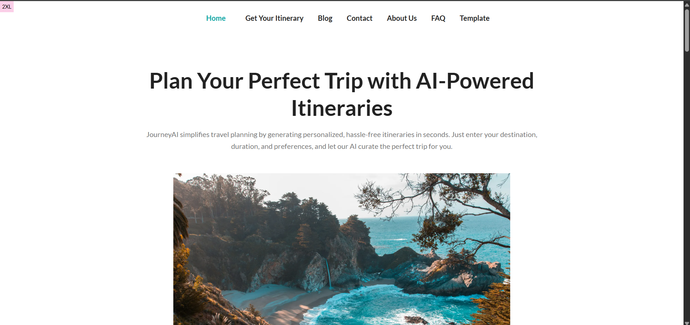

# Journey AI - Your Ultimate Travel Companion


## 🌍 About Journey AI

Journey AI is an intelligent travel assistant designed to make your trips seamless and enjoyable. With AI-powered recommendations, real-time updates, and multilingual support, Journey AI helps you explore the world with confidence.

---




## 🚀 Features

### 1️⃣ AI-Powered Itinerary Planning

&#x20;Get personalized travel plans tailored to your preferences using AI.

### 2️⃣ Real-Time Travel Updates

&#x20;Stay informed with real-time weather, traffic, and event updates.

### 3️⃣ Budget-Friendly Recommendations

&#x20;Find the best hotels, flights, and experiences within your budget.

### 4️⃣ Multilingual Support

&#x20;Navigate new destinations easily with AI-driven language translation.

### 5️⃣ AI-Powered Travel Assistant

&#x20;Get 24/7 support and instant travel suggestions from our AI assistant.

### 6️⃣ Sustainable Travel Suggestions

&#x20;Choose eco-friendly accommodations and experiences to reduce your carbon footprint.

---

## 📥 Installation & Setup

1. Clone this repository:
   ```sh
   git clone https://github.com/Dikshith-Manjunath/JourneyAI.git
   ```
2. Navigate to the project directory:
   ```sh
   cd Journey-AI
   ```
3. Install dependencies:
   ```sh
   npm install --legacy-peer-deps 
   ```
4. Start the application:
   ```sh
   npm run dev
   ```

---

## Docker Containerization

1. Docker Build:
   ```sh
   docker build -t my-project .
   ```
2. Docker Run:
   ```sh
   docker run -d -p 3000:3000 \
     -e NVIDIA_API_KEY=your_nvidia_api_key \
     -e MONGODB_URI=your_mongodb_uri \
     -e MONGODB_DB=your_db_name \
     -e UNSPLASH_ACCESS_KEY=your_unsplash_access_key \
     -e UNSPLASH_SECRET_KEY=your_unsplash_secret_key \
     my-project
   ```

---

## 🛠️ Tech Stack

- **Frontend:** Next.js, Tailwind CSS
- **Backend:** Node JS, Next.js, MongoDB, PostgreSQL
- **AI Models:** NVIDIA llama 3.1 Nemotron model / Custom ML Model

---

## 📩 Contact

For support or inquiries, reach out to us at:

- 📧 Email: [dikshithrrddy@gmail.com](mailto\:support@journeyai.com)
- 🌐 Website: [www.journeyai.shop](https://www.journeyai.shop)

---

### 📜 License

This project is licensed under the MIT License - see the [LICENSE](LICENSE) file for details.

---

Happy Travels! ✈️🌏

